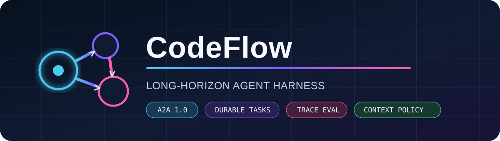
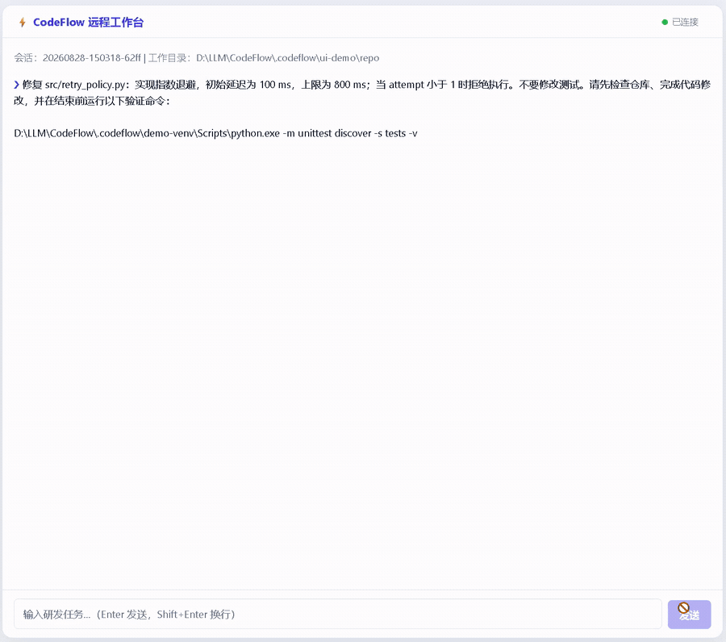
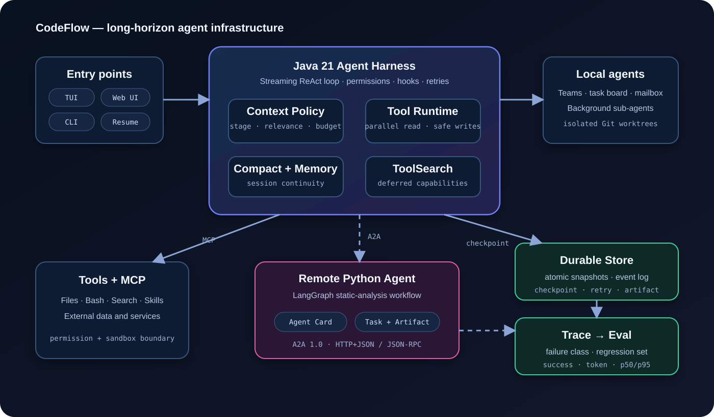
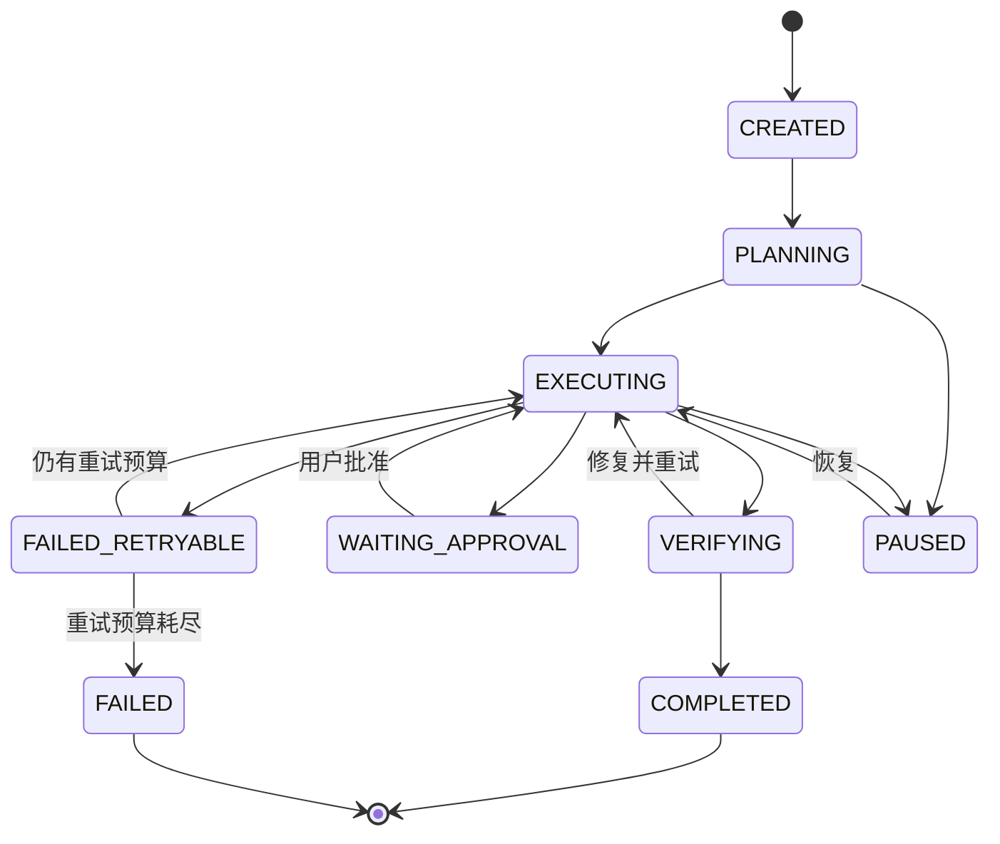

<div align="center">



# CodeFlow

**长程 Agent Harness · A2A 跨语言协作 · Eval 驱动开发**

[](https://github.com/This-Liao/CodeFlow/actions/workflows/ci.yml)
[](https://openjdk.org/projects/jdk/21/)
[](https://a2a-protocol.org/)
[](https://modelcontextprotocol.io/)
[](LICENSE)

CodeFlow 是一个面向仓库级研发任务的 Java 21 Agent Runtime。它将 ReAct 循环、本地多 Agent 与 Worktree 隔离、MCP 工具、A2A 跨语言委派、可恢复长程执行、上下文预算和基于 Trace 的回归评测整合在同一个工程化平台中。

[架构](#架构) · [快速开始](#快速开始) · [工程验证](#工程验证) · [A2A 演示](#跨语言-a2a-演示) · [评测](#eval-驱动开发) · [基准](#context--deferred-tool-基准) · [开发指南](#开发)

</div>



> 真实模型修复代码并运行测试：[录制证据](docs/demo/product-demo.json) · [工程验证](docs/VALIDATION.md)

## 为什么选择 CodeFlow

很多 Agent Demo 停留在单轮提示词，或者把所有协作者绑定到同一个框架。CodeFlow 面向需要多轮执行、可暂停恢复的仓库级研发任务，重点解决以下基础设施问题：

- **跨框架协作：** 通过 A2A 1.0 Agent Card 发现远程 Agent，而不是依赖框架私有 REST 接口。
- **可恢复执行：** 持久化任务状态、Checkpoint、事件和 Artifact，使中断任务能够从最近的安全阶段继续。
- **评测闭环：** 将真实运行 Trace 自动转化为失败分类和去重后的回归用例。
- **上下文工程：** 根据任务阶段、相关度和显式预算动态选择工具与长期记忆。
- **安全隔离：** 通过 Worktree、权限检查、操作系统沙箱和可审计工具调用隔离本地子 Agent。

## 架构





### 核心模块

| 模块 | 能力 |
|---|---|
| Agent Harness | 流式 ReAct 循环、并行只读工具、串行变更、Hooks、权限与重试 |
| 本地多 Agent | 后台子 Agent、Teams、Mailbox、任务看板、Coordinator 与 Git Worktree |
| A2A Host | A2A 1.0 Agent Card、HTTP+JSON、JSON-RPC、Task 轮询和 Artifact 归一化 |
| Durable Execution | 原子任务快照、追加式事件日志、乐观版本控制、跨进程恢复、暂停与重试 |
| Context Policy | 阶段识别、Tool Schema 预算、Deferred Tool 发现和相关 Memory 选择 |
| Eval Loop | Trace 捕获、八类失败分类、Regression JSONL、成功率、Token、延迟和工具错误报告 |
| 上下文连续性 | Tool Result Spill、自动 Compact、Recovery Attachment、Session 和长期 Memory |
| 安全机制 | 权限模式、前后置 Hook、系统沙箱、响应大小限制和不可信 A2A 数据边界 |

## 快速开始

环境要求：JDK 21+。可以使用更高版本 JDK 构建，但生成的字节码目标版本仍为 Java 21。

```bash
git clone https://github.com/This-Liao/CodeFlow.git
cd CodeFlow
mkdir -p .codeflow
cp config.example.yaml .codeflow/config.yaml

# 按配置的协议设置对应环境变量。
export OPENAI_API_KEY="..."

./gradlew shadowJar
java -jar build/libs/codeflow.jar
```

Windows PowerShell：

```powershell
New-Item -ItemType Directory -Force .codeflow | Out-Null
Copy-Item config.example.yaml .codeflow/config.yaml
$env:OPENAI_API_KEY = "..."
.\gradlew.bat shadowJar
java -jar build\libs\codeflow.jar
```

运行可恢复的非交互任务：

```bash
java -jar build/libs/codeflow.jar --durable -p "分析当前仓库，修复问题并运行测试"
# stderr 会输出：Durable task: cf-...
java -jar build/libs/codeflow.jar --resume-task cf-...
```

任务快照与事件日志保存在 `.codeflow/tasks/`，会话历史与 Compact 边界保存在 `.codeflow/sessions/`；这些运行数据都不会提交到 Git。配置统一使用 `.codeflow/config.yaml` 或 `CODEFLOW_CONFIG` 指定的路径。

## 工程验证

仓库提供可重复执行的一键验证，覆盖四层证据：Gradle 清理构建与完整测试；真实 Java → Python/LangGraph A2A 调用；外部强制终止 JVM-1 后由 JVM-2 从 Checkpoint 恢复且不重复修改；24 条固定任务的 Context / Deferred Tool 消融基准。

Linux/macOS：

```bash
python -m venv .codeflow/demo-venv
.codeflow/demo-venv/bin/pip install -e "examples/a2a-static-analysis-agent[recording]"
.codeflow/demo-venv/bin/python scripts/record_e2e_demo.py
```

Windows PowerShell：

```powershell
python -m venv .codeflow\demo-venv
.\.codeflow\demo-venv\Scripts\pip.exe install -e "examples\a2a-static-analysis-agent[recording]"
.\.codeflow\demo-venv\Scripts\python.exe scripts\record_e2e_demo.py
```

最近一次实测环境、测试总数、A2A 状态、Crash-Recovery 结果与耗时见 [`docs/VALIDATION.md`](docs/VALIDATION.md)，Context 消融结果见 [`docs/BENCHMARK.md`](docs/BENCHMARK.md)。机器可读结果分别保存在 [`docs/validation/latest.json`](docs/validation/latest.json) 和 [`docs/benchmarks/context-ablation.json`](docs/benchmarks/context-ablation.json)。

当前仓库内已提交的实测结果：

| 证据 | 结果 |
|---|---:|
| JUnit | 202 项，0 失败 |
| Java → Python A2A | 扫描 193 个 Java 文件，返回 1 个 Artifact |
| 强制崩溃恢复 | `EXECUTING → COMPLETED`，重复 Tool Call 为 0 |
| Context Policy | 24/24 任务成功，阶段识别 100%，Tool Schema 减少 75.7%，ToolSearch 错误为 0 |
| 真实模型对照 | `deepseek-v4-flash` 两组均 4/4 成功；Prompt Token 减少 14.8%，p95 延迟减少 65.9% |

## 跨语言 A2A 演示

Java Host 不直接调用 Python 的私有接口，而是遵循 A2A 协议：

1. 请求 `GET /.well-known/agent-card.json`，选择兼容的 A2A 1.x Interface。
2. 通过 `POST /message:send` 发送类型化 Message 与文本 Part。
3. 轮询 `GET /tasks/{id}`，处理 submitted、working、中断和终态。
4. 将 Markdown 和结构化 JSON Artifact 统一转换为父 Agent 可消费的结果。

启动 Python LangGraph Agent：

```bash
cd examples/a2a-static-analysis-agent
python -m venv .venv
source .venv/bin/activate
pip install -e .
export CODEFLOW_ANALYSIS_ROOT=/path/to/repository
codeflow-static-agent
```

Windows PowerShell 激活虚拟环境时使用：

```powershell
.\.venv\Scripts\Activate.ps1
$env:CODEFLOW_ANALYSIS_ROOT = "D:\path\to\repository"
codeflow-static-agent
```

随后按照 [`config.example.yaml`](config.example.yaml) 配置 `a2a_agents`。`A2ADelegate` 默认采用 Deferred Tool 机制，模型通过 `ToolSearch` 按需发现它，从而减少初始工具上下文。

示例 Agent 实现了 Agent Card、发送、查询、列表、取消、任务状态以及 Markdown/JSON Artifact。远程 Card 和结果均有大小限制，并在进入父模型之前被标记为不可信输入。

## 可恢复长程执行

每个长程任务按以下结构持久化：

```text
.codeflow/tasks/<task-id>/
├── task.json       # 原子替换的任务状态快照
└── events.jsonl    # 追加式生命周期审计日志
```

快照包含关联 Session、重试预算、恢复状态、乐观版本、Checkpoint 元数据和 Artifact。系统拒绝非法状态迁移与过期写入；`--resume-task` 会同时恢复 Durable Checkpoint 和支持 Compact 的会话历史。

工程验证会让 JVM-1 执行真实 `EditFile` 并原子写入 Checkpoint，然后从外部强制终止进程。JVM-2 重新加载同一任务、接管 owner、跳过已完成步骤，并校验工具审计次数与文件哈希。这里证明的是“安全 Checkpoint 边界上的至少一次调度、已完成步骤不重复执行”，不是任意副作用的分布式 exactly-once 承诺。

## Eval 驱动开发

Print Mode 会自动写入隐私友好的 Trace，模型隐藏推理不会被持久化：

```text
.codeflow/traces/*.json
        │
        ├── FailureClassifier
        │   ├── TOOL_SELECTION_ERROR
        │   ├── INVALID_TOOL_PARAMS
        │   ├── REPEATED_TOOL_CALL
        │   ├── CONTEXT_LOSS
        │   ├── SUBAGENT_FAILURE
        │   ├── VERIFICATION_FAILURE
        │   ├── TOOL_EXECUTION_ERROR
        │   └── MODEL_ERROR
        │
        └── .codeflow/evals/regression.jsonl
```

生成聚合评测报告：

```bash
java -jar build/libs/codeflow.jar --eval-report .codeflow/traces

# 与基线比较，并在指标退化时让 CI 失败。
java -jar build/libs/codeflow.jar \
  --eval-report .codeflow/traces \
  --baseline-report eval-baselines/main.json \
  --fail-on-regression
```

报告包含成功率、平均 Token、p50/p95 延迟、工具错误率、失败分布和非退化判断。

当前 `FailureClassifier` 是可解释的规则分类器，适合作为稳定的 CI 基线；它不会被描述为模型自优化。Trace → 分类 → 去重回归集 → 基线对比构成可复现的 Eval-driven development 闭环。

## 上下文工程

`ContextPolicy` 根据最近消息和工具结果识别 `PLANNING`、`EXECUTING`、`VERIFYING` 或 `RECOVERING` 阶段，并执行以下策略：

- 优先选择与当前阶段相关的工具；
- 控制 Tool Schema 数量与字符预算；
- 始终保留发现工具和审批工具；
- 允许通过 `ToolSearch` 精确恢复被省略的工具；
- 在独立预算内选择相关长期 Memory 段落；
- 与 Tool Result Spill、Compact 和 Recovery Attachment 协同工作。

## Context / Deferred Tool 基准

仓库内置 24 条固定任务和 46 个工具的消融基准，对比全量注入、Deferred Tool 和阶段感知 Context Policy。它直接运行 Java 实现，校验阶段识别、初始 Tool Recall、Schema 字符数、`ToolSearch` 恢复和工具错误；CI 要求任务成功率与阶段识别均为 100%、Schema 至少减少 60%、工具错误为 0。

```bash
java -cp build/libs/codeflow.jar com.codeflow.benchmark.ContextAblationMain
```

[`docs/BENCHMARK.md`](docs/BENCHMARK.md) 中的 Estimated Input Tokens 只按 Schema 字符数估算，用于同任务集的相对比较，不冒充模型账单或真实语义成功率。

如本机已配置付费模型，可额外运行隔离、只读的真实模型对照。该脚本记录实际 API Usage、任务成功率、Tool Call 和延迟，但不把 Key、Base URL 或回答正文写入报告：

```bash
python -m pip install -e "examples/a2a-static-analysis-agent[benchmark]"
python scripts/run_model_benchmark.py --config /path/to/config.yaml
```

最新一次 [`deepseek-v4-flash` 实测报告](docs/MODEL_BENCHMARK.md)中，两组均为 4/4 成功且工具错误为 0；Context Policy 将平均完整 Prompt Token 从 7020 降至 5981（减少 14.8%），p95 延迟从 26.1 秒降至 8.9 秒（减少 65.9%）。该结果只有 4 条固定任务，受模型版本、缓存与采样影响，因此作为 Semantic Layer 证据，不作为默认 CI 门禁。

## 开发

```bash
./gradlew test
./gradlew shadowJar
```

测试覆盖协议解析与轮询、任务恢复与版本冲突、失败分类、回归门禁、上下文选择、Memory/Compact、权限、工具、Teams、Session 和 Worktree。GitHub Actions 会在 Java 21 环境下同时运行 Linux 与 Windows 测试，并在 Ubuntu 上执行 A2A、强制崩溃恢复和 Context 基准门禁。

更多信息请参阅 [`CONTRIBUTING.md`](CONTRIBUTING.md)、[`SECURITY.md`](SECURITY.md) 和[项目路线图](docs/ROADMAP.md)。

## 开源协议

项目采用 Apache License 2.0。第三方组件和可选 Skill 保留各自的许可证声明，详见 [`NOTICE`](NOTICE)。
