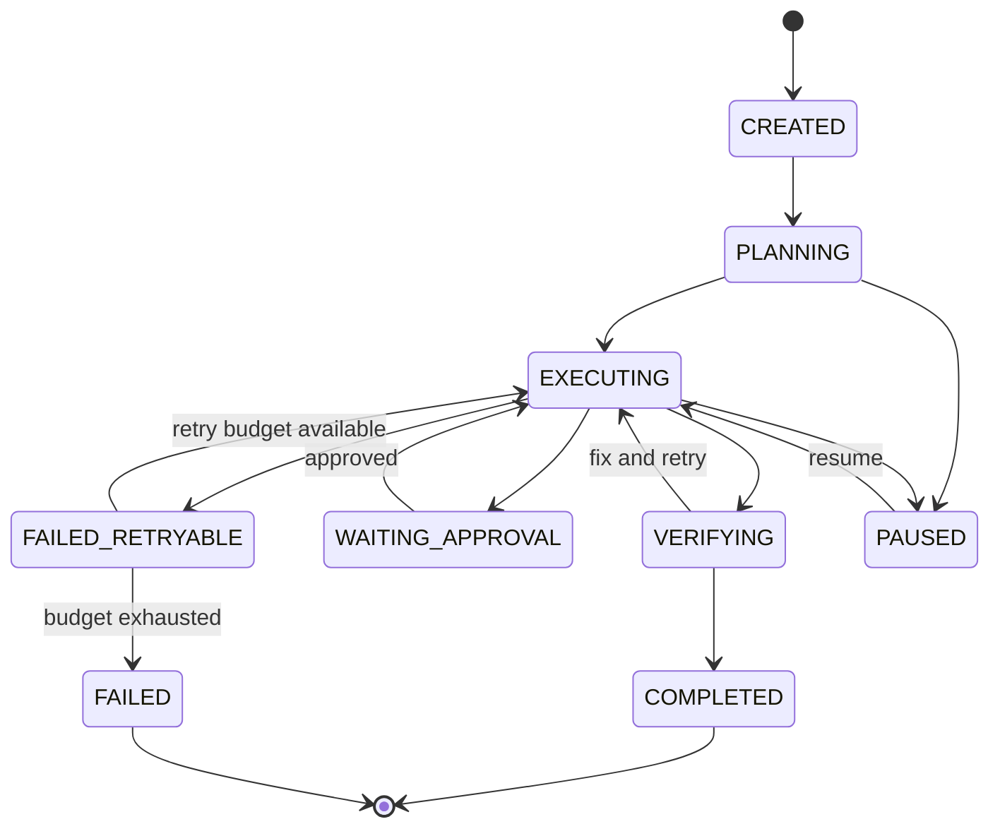

<div align="center">


# CodeFlow

**Long-Horizon Agent Harness · A2A Interoperability · Eval-Driven Development**

[](https://github.com/This-Liao/CodeFlow/actions/workflows/ci.yml)
[](https://openjdk.org/projects/jdk/21/)
[](https://a2a-protocol.org/)
[](https://modelcontextprotocol.io/)
[](LICENSE)

CodeFlow is a Java 21 agent runtime for repository-scale engineering tasks. It combines a ReAct loop, local multi-agent/worktree isolation, MCP tools, cross-language A2A delegation, crash-safe durable execution, context budgeting, and trace-based regression evaluation.

[Architecture](#architecture) · [Quick start](#quick-start) · [A2A demo](#cross-language-a2a-demo) · [Evaluation](#eval-driven-development) · [中文说明](#中文概览)

</div>


> The animation is generated from [`scripts/generate_demo_gif.py`](scripts/generate_demo_gif.py) and illustrates the real lifecycle and protocol flow implemented in this repository.

## Why CodeFlow

Most agent demos stop after one prompt or couple every collaborator to one framework. CodeFlow focuses on infrastructure that becomes necessary when an engineering task lasts for hours:

- **Interoperability:** discover remote agents through an A2A 1.0 Agent Card instead of framework-specific REST contracts.
- **Durability:** persist state, checkpoints, events, and artifacts so an interrupted task resumes from its last safe stage.
- **Evaluation:** turn production traces into classified failures and deduplicated regression cases.
- **Context engineering:** choose tools and memories using the current task stage, relevance, and explicit budgets.
- **Isolation:** run local sub-agents in worktrees with permission checks, OS sandboxing, and auditable tool calls.

## Architecture




### Core modules

| Module | What it does |
|---|---|
| Agent harness | Streaming ReAct loop, parallel read tools, sequential mutations, hooks, permissions, retries |
| Local multi-agent | Background sub-agents, teams, mailbox/task board, coordinator mode, Git worktrees |
| A2A host | A2A 1.0 Agent Card discovery, HTTP+JSON and JSON-RPC, Task polling, Artifact normalization |
| Durable execution | Atomic task snapshots, append-only event log, optimistic version checks, pause/resume/retry |
| Context policy | Stage inference, Tool Schema budget, deferred discovery, relevance-based memory selection |
| Eval loop | Trace capture, eight failure classes, regression JSONL, success/token/latency/tool-error reports |
| Context continuity | Tool-result spill, automatic compaction, recovery attachments, sessions and long-term memory |
| Safety | Permission modes, pre/post hooks, Linux/macOS sandboxes, response limits, untrusted A2A boundaries |

## Quick start

Requirements: JDK 21+ (the build can run on a newer JDK while targeting Java 21).

```bash
git clone https://github.com/This-Liao/CodeFlow.git
cd CodeFlow
mkdir -p .mewcode
cp config.example.yaml .mewcode/config.yaml

# Choose the environment variable expected by your configured protocol.
export OPENAI_API_KEY="..."

./gradlew shadowJar
java -jar build/libs/codeflow.jar
```

Windows PowerShell:

```powershell
New-Item -ItemType Directory -Force .mewcode | Out-Null
Copy-Item config.example.yaml .mewcode/config.yaml
$env:OPENAI_API_KEY = "..."
.\gradlew.bat shadowJar
java -jar build\libs\codeflow.jar
```

Run a resumable non-interactive task:

```bash
java -jar build/libs/codeflow.jar --durable -p "Analyze this repository, fix the bug, and run the tests"
# stderr prints: Durable task: cf-...
java -jar build/libs/codeflow.jar --resume-task cf-...
```

Runtime state is stored under `.codeflow/`; conversation history and compaction boundaries remain under `.mewcode/`. Both are excluded from Git.

## Cross-language A2A demo

The Java host does not call a custom Python endpoint. It follows the A2A protocol:

1. `GET /.well-known/agent-card.json` and select a compatible A2A 1.x interface.
2. `POST /message:send` with a typed Message and text Part.
3. Poll `GET /tasks/{id}` across submitted/working/interrupted/terminal states.
4. Normalize Markdown and structured JSON Artifacts into the parent agent result.

Start the Python LangGraph agent:

```bash
cd examples/a2a-static-analysis-agent
python -m venv .venv
source .venv/bin/activate
pip install -e .
export CODEFLOW_ANALYSIS_ROOT=/path/to/repository
codeflow-static-agent
```

Then configure `a2a_agents` as shown in [`config.example.yaml`](config.example.yaml). `A2ADelegate` is deferred by default; the model discovers it through `ToolSearch`, keeping the initial tool context small.

The sample implements Agent Card discovery, send/get/list/cancel operations, task states, and Markdown/JSON Artifacts. Remote cards and results are size-limited and wrapped as untrusted input before reaching the parent model.

## Durable execution

Each long-running task is persisted as:

```text
.codeflow/tasks/<task-id>/
├── task.json       # atomically replaced state snapshot
└── events.jsonl    # append-only lifecycle audit log
```

Snapshots include session linkage, retry budget, resume state, optimistic version, checkpoint metadata, and artifacts. Invalid state transitions and stale writers are rejected. `--resume-task` reloads both the durable checkpoint and the compact-aware conversation session.

## Eval-driven development

Print-mode runs automatically write privacy-conscious traces (hidden model reasoning is never persisted):

```text
.codeflow/traces/*.json
        │
        ├── FailureClassifier
        │   ├── TOOL_SELECTION_ERROR
        │   ├── INVALID_TOOL_PARAMS
        │   ├── REPEATED_TOOL_CALL
        │   ├── CONTEXT_LOSS
        │   ├── SUBAGENT_FAILURE
        │   ├── VERIFICATION_FAILURE
        │   ├── TOOL_EXECUTION_ERROR
        │   └── MODEL_ERROR
        │
        └── .codeflow/evals/regression.jsonl
```

Generate an aggregate report:

```bash
java -jar build/libs/codeflow.jar --eval-report .codeflow/traces

# Compare against a checked baseline and make CI fail on regression.
java -jar build/libs/codeflow.jar \
  --eval-report .codeflow/traces \
  --baseline-report eval-baselines/main.json \
  --fail-on-regression
```

The report includes success rate, average tokens, p50/p95 latency, tool-error rate, failure distribution, and a non-regression decision.

## Context engineering

`ContextPolicy` infers `PLANNING`, `EXECUTING`, `VERIFYING`, or `RECOVERING` from recent messages and tool outcomes. It then:

- prioritizes stage-relevant tools;
- applies Tool Schema count/character budgets;
- preserves essential discovery/approval tools;
- exposes omitted tools through `ToolSearch` for exact recovery;
- selects relevant long-term memory paragraphs under a separate budget;
- composes with existing tool-result spill, compaction, and recovery attachments.

## Development

```bash
./gradlew test
./gradlew shadowJar
```

The test suite covers protocol parsing/polling, lifecycle recovery and version conflicts, failure classification, regression gates, context selection, memory/compaction, permissions, tools, teams, sessions, and worktrees. CI runs on Linux and Windows with Java 21.

See [`CONTRIBUTING.md`](CONTRIBUTING.md), [`SECURITY.md`](SECURITY.md), and the [roadmap](docs/ROADMAP.md).

## 中文概览

CodeFlow 是一个面向长程研发任务的 Java 21 Agent Harness。本次扩展把原有 ReAct、多 Agent、MCP、ToolSearch、Compact、Memory、Checkpoint、Skill、Worktree、权限与沙箱能力升级为四条可展示的工程闭环：

- **A2A 跨语言协作：**Java Host 通过 Agent Card 发现 Python LangGraph Agent，统一管理远程 TaskState 与 Artifact。
- **Durable Agent：**任务状态、Checkpoint、事件日志和 Artifact 落盘；进程中断后通过任务 ID 和会话历史恢复。
- **Eval 驱动开发：**真实 Trace 自动分类失败、沉淀回归集，并比较成功率、Token、p50/p95、工具错误率。
- **Context Engineering：**按照任务阶段、工具相关性、Memory 相关性和预算动态组装每轮上下文。

## License

Apache License 2.0. Third-party components and bundled skills retain their own license notices. See [`NOTICE`](NOTICE).
